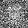
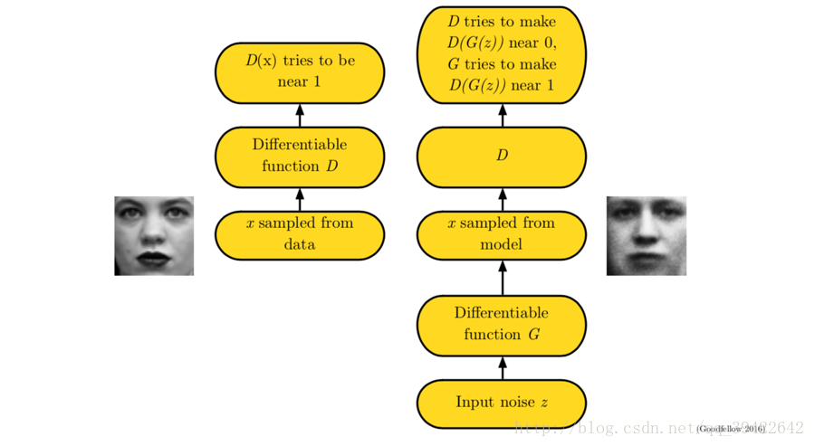
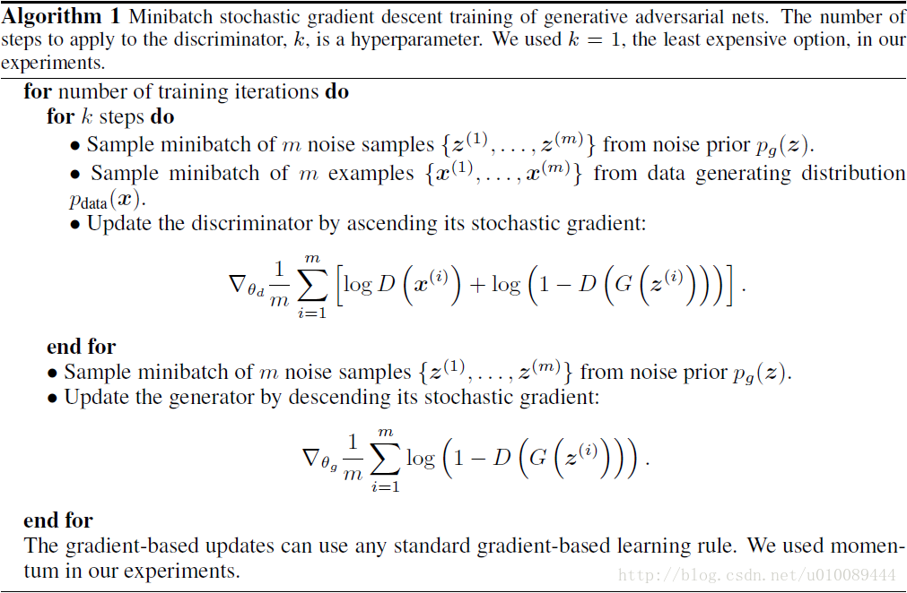

# GAN(生成式对抗网络)

[Github地址](http://)

参考：
[生成式对抗网络（Generative Adversarial Networks，GANs）](https://blog.csdn.net/u010089444/article/details/78946039)
[Generative Adversarial Networks-Ian GoodFellow](http://papers.nips.cc/paper/5423-generative-adversarial-nets
)

- 不要怂，就是**GAN(Generative Adversarial Networks)**！
- 时隔一个多月，更新一篇博客。一个多月忙完保研，看了机器学习，一直在做卷积神经网络的实现。自己写了一个MINI神经网络框架，上周刚跑了MNIST，还没来得及更，之后一并更新。
- 接到南开实验室的一个题目，要用到GAN。所以刷完GoodFellow的原文，用自己的小框架实现一哈GAN生成MNIST的实验。

先放上生成过程的gif图：一个100维的随机向量，送入生成网络，输出一个28*28的图片。由一开始输出不知道是啥的生成图片，到最后稳定输出数字‘0’。GAN的魅力可见一斑。

## 网络结构

- 上图展示了GAN的流程，涉及两个关键的函数$D(x)$和$G(x)$.所以GAN的两个关键角色为：生成器网络**Generator Network**与判别器网络**Discriminator Network**。

##### Generator Network

- 不断学习训练集中真实数据的概率分布，目标是将输入的随机噪声转换为以假乱真的数据（如：生成的图片与训练集中的图片越相似越好）。

##### Discriminator Network

- 判断一个数据是否是真是的数据，目标是将生成网络产生的“假”数据与训练集中的“真”数据区分开。

##### Train

- GAN基于**二人零和极小极大博弈**。其训练过程中让**D**和**G**进行博弈，相互的竞争让这两个模型同时得到增强。
- 由于判别网络**G**的存在，使得**G**在没有大量先验知识以及先验分布的前提下也能很好的去逼近真实数据的分布，并最终生成的数据达到以假乱真的效果。(即**D**无法区分**G**生成的数据与真实数据，从而两个网络达到某种平衡。)

### 目标函数

$$
\min_G \max_D V(D,G) = \mathbb{E}_{x \sim p_{data}(x)}[\log D(x)] + \mathbb{E}_{z \sim p_z(z)}[\log (1 - D(G(z)))]
$$

- 这是原论文提出的优化目标函数，要更新**D**时最大化上式；更新**G**时最小化上式。
- 在对判别模型**D**的参数进行更新时：对于来自真实分布$p_{data}$的样本$x$而言，我们希望$D(x)$的输出越接近**1**越好，即$\log D(x)$越大越好；对于噪声$z$生成的数据$G(z)$而言，我们希望$D(G(z))$尽量接近0，因此$\log (1-D(G(z)))$也是越大越好，所以需要$\max D$。
- 在对生成模型**G**的参数进行更新时：我们希望$G(z)$尽可能和真实数据一样，即分布相同：$p_g = p_{data}$。因此，我们希望$D(G(z))$尽量接近1，既$\log (1-D(G(z)))$越小越好，所以需要$\min G$.

## 算法流程

- 算法流程截取自论文原文，详细描述了训练GAN的过程。
- 

## 实验部分